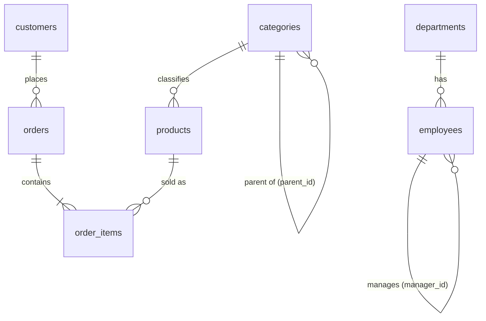

# Module 0: Setup & SQL Refresher

**Level:** Beginner  |  **Time:** about 1.5 hours  |  **Files:** [`examples.sql`](examples.sql) · [`exercises.md`](exercises.md)

## What you will do

1. Run a PostgreSQL practice database on your machine.
2. Load the course dataset and verify it.
3. Take a tour of the tables you will use for the next 14 modules.
4. Refresh the SQL you need before CTEs make sense: joins, grouping and, above all, **subqueries**.

## Prerequisites

You should be comfortable with basic `SELECT` queries. Everything else is revisited below. You need PostgreSQL **14 or newer** (the `SEARCH` and `CYCLE` clauses in Module 10 need 14; `MATERIALIZED` hints in Module 7 need 12).

---

## 0.1 Set up the database

Pick **one** option.

### Option A: Docker (recommended, one command)

From the repository root:

```bash
docker compose up -d
docker compose exec db psql -U postgres -d cte_lab
```

The first start creates the `cte_lab` database and loads `data/schema_and_data.sql` automatically. To wipe everything and start fresh: `docker compose down -v` and then `docker compose up -d` again.

### Option B: PostgreSQL already installed

```bash
createdb cte_lab
psql -d cte_lab -f data/schema_and_data.sql
psql -d cte_lab
```

> You can also use a GUI such as pgAdmin, DBeaver or the PostgreSQL extension for VS Code. Open a connection to the `cte_lab` database and paste queries in.

### Useful `psql` commands

| Command | What it does |
|---|---|
| `\dt` | List tables |
| `\d employees` | Describe a table (columns, keys) |
| `\timing` | Show how long each query takes |
| `\i path/to/file.sql` | Run a SQL file |
| `\q` | Quit |

## 0.2 Verify the load

The load script ends with a row-count check. You should see:

| table | rows | | table | rows |
|---|---|---|---|---|
| departments | 7 | | order_items | 286 |
| employees | 30 | | routes | 12 |
| customers | 30 | | parts | 20 |
| categories | 12 | | bom | 20 |
| products | 20 | | customers_raw | 20 |
| orders | 120 | | | |

If a count is off, drop the database and reload. (Exercise 00-01 asks you to write this check yourself.)

## 0.3 Tour of the dataset

All data is **synthetic**. Each table exists to teach a specific idea later in the course.



| Table(s) | What is special about it | Used in |
|---|---|---|
| `employees`, `departments` | `manager_id` points back to `employees`, forming a 5-level hierarchy. Marketing has no employees. | Modules 1, 5, 9 |
| `customers`, `orders`, `order_items`, `products` | A small shop: 120 orders, 286 line items. Four customers never ordered. `orders.shipping_fee` is order-level, which sets up the join fan-out trap. | Modules 2 to 5, 7, 14 |
| `categories` | A 3-level tree (Electronics > Computers > Laptops). | Module 9 |
| `routes` | A directed city graph **with cycles**. | Module 10 |
| `parts`, `bom` | A bicycle bill of materials. | Module 11 |
| `customers_raw` | Duplicates, blanks, bad emails. | Modules 6, 12 |

The full column list is in the workbook in [`docs/`](../docs/) (sheet `Data_Dictionary`).

---

## 0.4 SQL refresher

Every query below is in [`examples.sql`](examples.sql). Run the whole file, or paste them one at a time.

### Filtering and sorting

```sql
SELECT emp_id, first_name, last_name, salary
FROM employees
WHERE dept_id = 6 AND salary > 70000
ORDER BY salary DESC;
```

Result: 5 rows, led by Farid Rahman (160,000.00).

### Joins

An `INNER JOIN` keeps only rows that match on both sides. A `LEFT JOIN` keeps **every** row from the left table and fills the right side with `NULL` when nothing matches.

```sql
SELECT d.dept_name, COUNT(e.emp_id) AS headcount
FROM departments d
LEFT JOIN employees e ON e.dept_id = d.dept_id
GROUP BY d.dept_name
ORDER BY headcount, d.dept_name;
```

```
    dept_name     | headcount
------------------+-----------
 Marketing        |         0
 Executive        |         1
 HR               |         3
 Finance          |         4
 Data & Analytics |         7
 Sales            |         7
 Engineering      |         8
```

Marketing appears with `0` only because of the `LEFT JOIN`. With an `INNER JOIN` it would vanish. Note also `COUNT(e.emp_id)`, not `COUNT(*)`: counting a column ignores the `NULL`s from unmatched rows.

A **self join** joins a table to itself, using two aliases for the two roles (employee and manager):

```sql
SELECT e.first_name AS employee, m.first_name AS manager
FROM employees e
LEFT JOIN employees m ON m.emp_id = e.manager_id
WHERE e.emp_id IN (1, 14, 30)
ORDER BY e.emp_id;
```

The CEO (Amina) has no manager, so her `manager` is `NULL`.

### Grouping: `WHERE` vs `HAVING`

`WHERE` filters **rows before** grouping. `HAVING` filters **groups after** aggregation.

```sql
SELECT dept_id, COUNT(*) AS headcount, ROUND(AVG(salary), 2) AS avg_salary
FROM employees
GROUP BY dept_id
HAVING COUNT(*) > 3
ORDER BY dept_id;
```

### Subqueries: the four shapes

A **subquery** is a query inside another query. CTEs are essentially a cleaner way of writing them, so recognise all four:

| Shape | Returns | Example |
|---|---|---|
| Scalar subquery | one value | `WHERE salary > (SELECT AVG(salary) FROM employees)` |
| `IN` subquery | a list of values | `WHERE customer_id IN (SELECT customer_id FROM orders)` |
| Correlated subquery | re-run **per outer row** | `WHERE e.salary > (SELECT AVG(x.salary) FROM employees x WHERE x.dept_id = e.dept_id)` |
| Derived table | a whole table, in `FROM` | `FROM (SELECT dept_id, AVG(salary) ... GROUP BY dept_id) s` |

The correlated subquery refers to the outer query (`e.dept_id`), which is why it must be evaluated in the context of each outer row. It finds 12 employees who earn more than their own department's average.

## 0.5 The problem CTEs solve

Business question: *which departments are larger than the average department?*

```sql
SELECT dept_name, headcount
FROM (SELECT d.dept_name, COUNT(*) AS headcount
      FROM employees e
      JOIN departments d ON d.dept_id = e.dept_id
      GROUP BY d.dept_name) dept_size
WHERE headcount > (SELECT AVG(headcount)
                   FROM (SELECT COUNT(*) AS headcount
                         FROM employees
                         GROUP BY dept_id) x)
ORDER BY headcount DESC, dept_name;
```

It returns the right answer (Engineering 8, Data & Analytics 7, Sales 7), but try to explain it out loud. You have to start in the middle of the query, find the innermost `SELECT`, and work outwards. The same department count is also written twice. Real reports have many more steps than this.

Writing SQL top to bottom, with each step named, is exactly what a CTE gives you. That is Module 1.

## Common mistakes in this module

| Mistake | Why it hurts | Fix |
|---|---|---|
| `INNER JOIN` when you need all rows from one side | Silently drops rows (Marketing disappears) | Use `LEFT JOIN` and check row counts |
| `COUNT(*)` after a `LEFT JOIN` | Counts the `NULL` row as 1 | `COUNT(right_table.id)` |
| Filtering an aggregate in `WHERE` | Error: aggregates are not allowed in `WHERE` | Use `HAVING` |
| Forgetting `ORDER BY` | Row order is not guaranteed | Always sort when order matters |

## Key takeaways

- Load the data once; every later module reuses it.
- `LEFT JOIN` preserves rows, `INNER JOIN` filters them.
- `WHERE` filters rows, `HAVING` filters groups.
- Subqueries come in four shapes, and deeply nested ones are hard to read and debug.

## Checkpoint

<details>
<summary>1. Why does Marketing appear in the headcount query?</summary>

Because `departments` is the left table in a `LEFT JOIN`, so every department is kept, and `COUNT(e.emp_id)` counts only non-`NULL` employee ids, giving 0.
</details>

<details>
<summary>2. What is the difference between <code>WHERE</code> and <code>HAVING</code>?</summary>

`WHERE` filters individual rows before `GROUP BY`; `HAVING` filters the groups produced by `GROUP BY`, so it can use aggregates such as `COUNT(*)`.
</details>

<details>
<summary>3. Which subquery shape is re-evaluated for each outer row?</summary>

The correlated subquery, because it references a column from the outer query.
</details>

**Next:** do the [exercises](exercises.md), then continue to [Module 1: What Is a CTE?](../01-what-is-a-cte/lesson.md)
